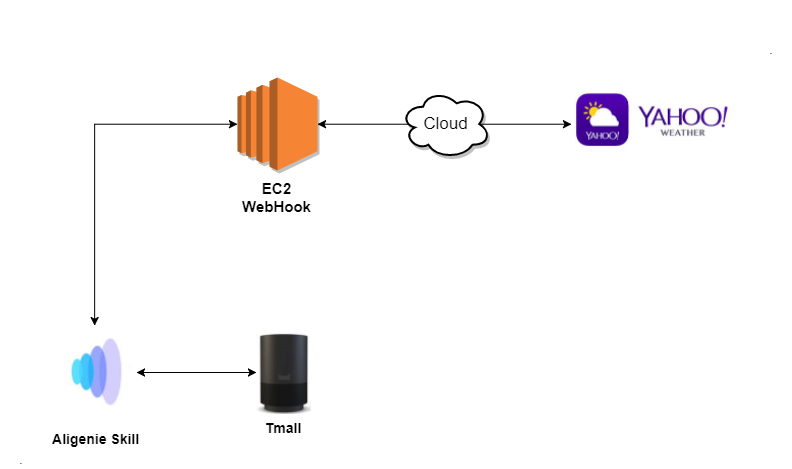
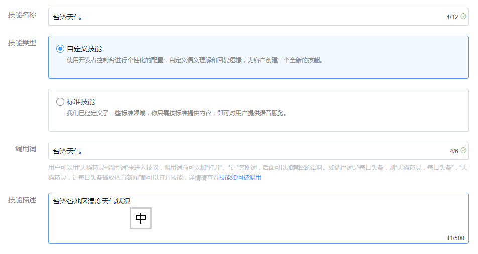
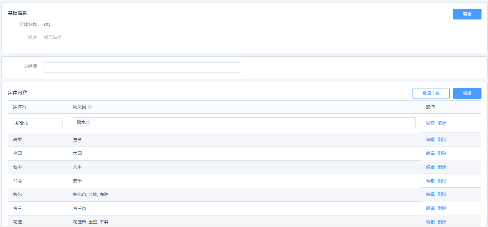
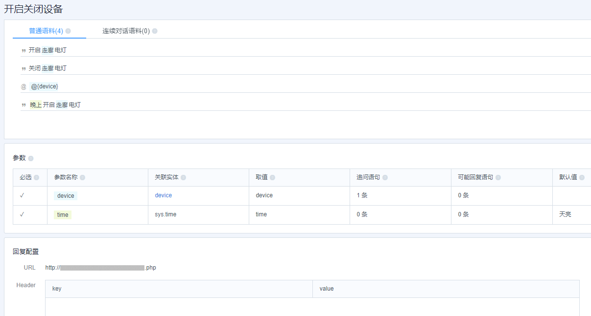
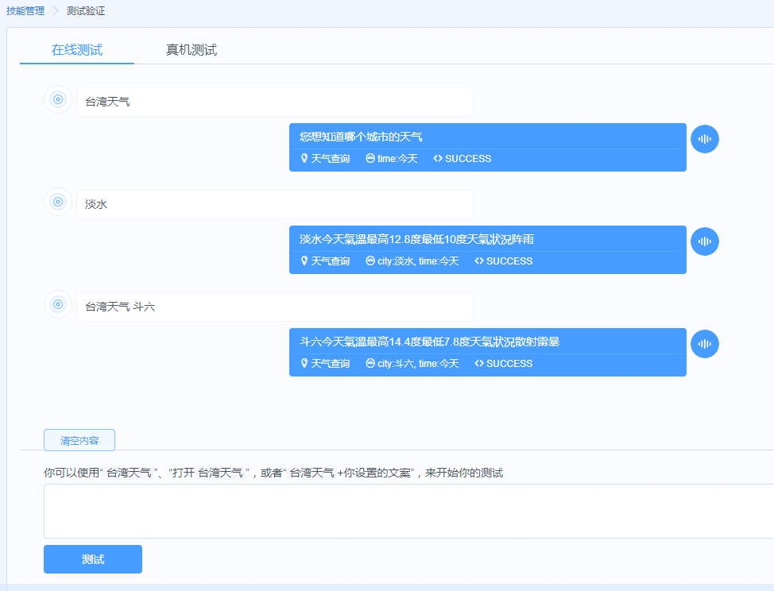
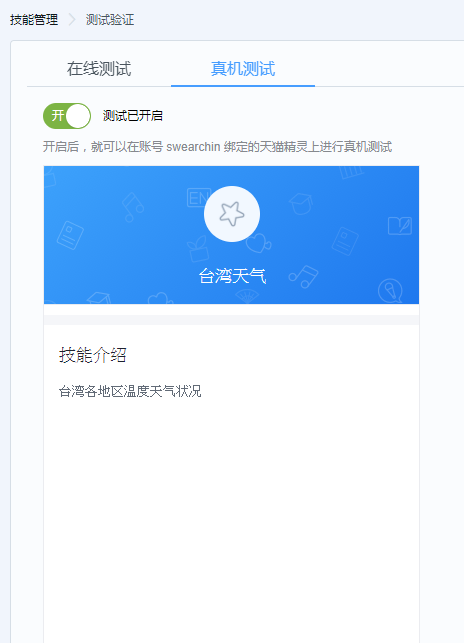
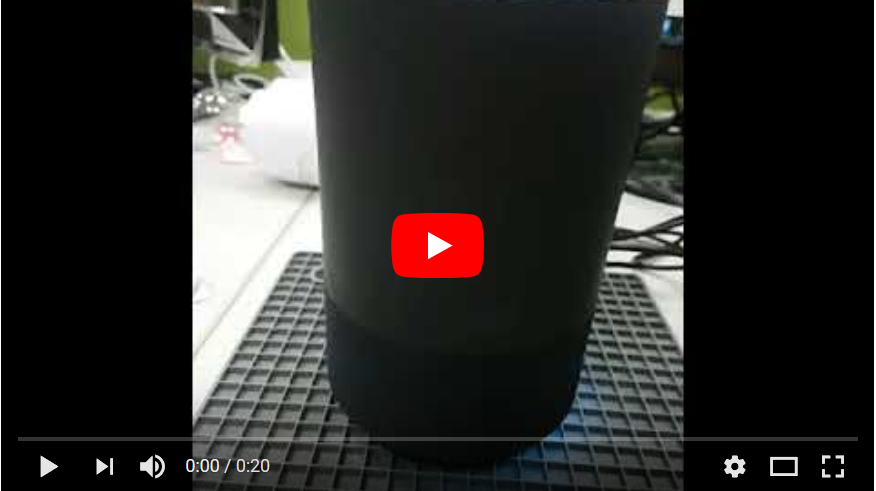

## Alexa Skills - Taiwan Weather


### Structure



-------------
### [AliGenie 语音开发者平台](https://open.bot.tmall.com/)
##### [5步创建自定义技能](http://doc-bot.tmall.com/docs/doc.htm?spm=0.0.0.0.3616ou&treeId=393&articleId=106714&docType=1)
##### 步骤一：新建技能
> 技能種類 
> + 自定义技能
> + 标准技能

> 调用词：需確認是否可使用

> 技能描述


##### 步骤二： 设置「实体 」
> 实体名稱 
> + 实体名
> + 同义词：Enter 鍵新增，最後與实体一起保存



##### 步骤三： 设置「意图」
> 意图名稱 
> + [语音对话内容编写](http://doc-bot.tmall.com/docs/doc.htm?spm=0.0.0.0.t4Em1I&treeId=393&articleId=106994&docType=1)
> + 例句：鼠标选中语句中我们需要标注的部分，页面上会自动弹出支持标注的实体
> ++ 模版：@{參數}
> ++ 參數
> + [业务逻辑配置](http://doc-bot.tmall.com/docs/doc.htm?spm=0.0.0.0.jr8Pu5&treeId=393&articleId=106952&docType=1)：回复配置 (WebHook )



##### 步骤四： 配置执行逻辑
> + [业务逻辑配置](http://doc-bot.tmall.com/docs/doc.htm?spm=0.0.0.0.jr8Pu5&treeId=393&articleId=106952&docType=1)：
> + 回复配置 (WebHook)
> + 程式码： AliGenieSkills-TaiwanWeather\WebHook\skill\weather.php
```
<?php
    require("yahoo_weather.php");

    $foo = file_get_contents("php://input");
    $jsonObj = json_decode($foo, true);

	// ================================== Parser Aligenie Skill JSON
    $utterance = $jsonObj['utterance'];
    $original = "";
    foreach($jsonObj['slotEntities'] as $k=>$v){
        if ($v['intentParameterName']=== 'city'){
            $original = $v['originalValue'];
            break;
        }
    }
    $reply = "无法查询该城市天气";
    // ================================== query Weather from yahoo
    if (!empty($original)){
        $woeid = getWoeId($original); 
        if (!empty($woeid)){
            $data = file_get_contents('https://query.yahooapis.com/v1/public/yql?q=select%20*%20from%20weather.forecast%20where%20woeid%20in%20(select%20woeid%20from%20geo.places(1)%20where%20woeid="' . $woeid . '")&format=json&env=store://datatables.org/alltableswithkeys');
            $jsonObj = json_decode($data, true);
            $code  = $jsonObj['query']['results']['channel']['item']['forecast']['0']['code'];
            $fH  = $jsonObj['query']['results']['channel']['item']['forecast']['0']['high'];
            $fL  = $jsonObj['query']['results']['channel']['item']['forecast']['0']['low'];
            $cH = round(($fH-32)*5/9, 1);
            $cL = round(($fL-32)*5/9, 1);
            $codeName = getCodeName($code);        
            $reply = $original . "今天气温最高" . $cH . "度最低" . $cL . "度天气状况" . $codeName;
        }
    }
	// ================================== Echo Result for Aligenie
    $resultObj->returnCode = "0";
    $resultObj->returnErrorSolution = "";
    $resultObj->returnMessage = "";
        $returnValue->reply= $reply;
        $returnValue->resultType= "RESULT";
    $resultObj->returnValue=$returnValue;
    $resultObj->executeCode="SUCCESS";
    $resultObj->msgInfo="";
    $resultJSON = json_encode($resultObj);
    echo $resultJSON;
?>
```

##### 步骤五： 测试验证
> 在线测试 
> + 使用「调用语」及「意图」测试

> 真机测试 
> + 开启真机测试开关，天猫精灵 App 及 天猫精灵 无须额外设置，即可直接进行测试


-------------
### [YouTube Demo](https://youtu.be/rDqrWlMelZc)

<a href="https://youtu.be/rDqrWlMelZc" target="_blank"></a>

